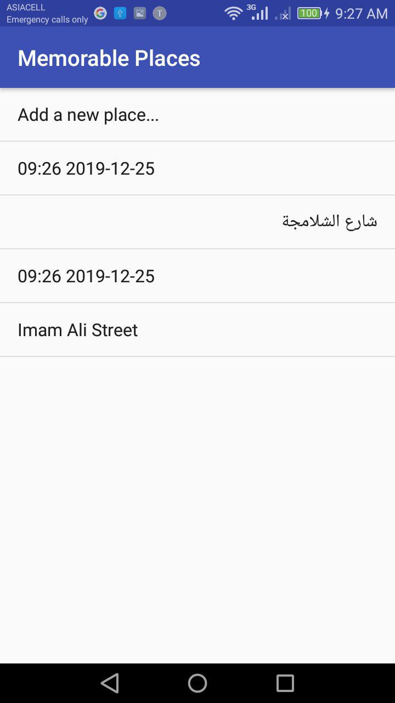

# MemorablePlaces
Simple Learning App
With this app you can select places from the map and store it on the device,
after that whenever you back and click on the place it will show marked in the map

